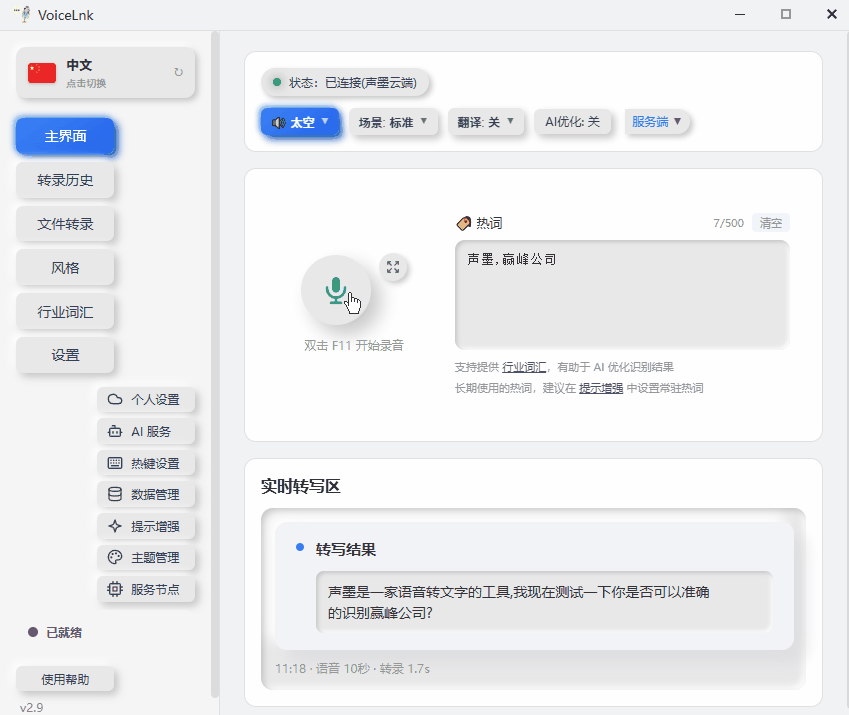

# VoiceInk / 声墨 - 本地语音识别服务

> 声墨（[VoiceLnk](https://www.voicelnk.cn/)）的开源核心引擎，基于 FunASR/SenseVoice 的本地语音识别服务。
>
> 官方网站：[www.voicelnk.cn](https://www.voicelnk.cn/)



## 关于本项目

本仓库是**声墨**语音识别的开源后端引擎：

- **开源部分**：模型加载与推理（SenseVoice、Paraformer、Faster-Whisper 等）、VAD 语音活动检测、标点恢复、JSON-RPC 服务接口
- **未开源部分**：声墨官方前端应用

**想自己接入前端？** 本服务通过 JSON-RPC over stdio 与任意前端通信，自己实现一个前端直接调用即可，技术栈和风格完全自由。

---

本项目由个人开发者维护，利用业余时间学习并开发。开源后端的初衷是让有需要的开发者可以直接接入语音识别能力，而不必重复造轮。前端目前未开源，主要原因是它属于个人学习产物，架构和代码质量尚不理想，暂未做重构；未来可能会逐步重构简化后开源，或者直接重新实现一个干净的版本——通过 API 调用本服务接入语音识别非常方便。

如果更新不及时或存在 bug，请多包涵，也欢迎提 [Issue](../../issues) 指出，非常感谢。

## 特性

- 🎯 **多模型支持**: SenseVoice PyTorch、Paraformer、Faster-Whisper、Fun-ASR-Nano-2512
- 🔒 **完全本地**: 无需联网，数据不出本地
- 🎨 **VAD 支持**: Silero VAD 语音活动检测，智能断句
- ✨ **标点恢复**: CT-Punc 自动添加标点符号
- 🚀 **易于集成**: JSON-RPC 协议，支持任意语言的前端调用

## 快速开始

### 1. 创建环境

```bash
# 推荐使用 conda 创建虚拟环境
conda create -n voiceink python=3.10
conda activate voiceink
```

> 后续每次使用前都需要先执行 `conda activate voiceink` 激活环境，激活后才能直接使用 `python` 命令。

**CPU 版本（默认）：**

```bash
pip install -r requirements.txt --extra-index-url https://download.pytorch.org/whl/cpu
```

**GPU 版本（需要 NVIDIA 显卡 + CUDA 11.8 或 12.x）：**

```bash
# CUDA 11.8
pip install -r requirements-gpu.txt --extra-index-url https://download.pytorch.org/whl/cu118
# CUDA 12.1
pip install -r requirements-gpu.txt --extra-index-url https://download.pytorch.org/whl/cu121
```

### 2. 下载模型

**从 ModelScope 下载 SenseVoice PyTorch（推荐）：**

```bash
pip install modelscope
modelscope download --model iic/SenseVoiceSmall --local_dir ./models/SenseVoiceSmall
```

### 3. 测试运行

```bash
# 测试转写（需要准备一个 16kHz WAV 音频文件）
python test_transcribe.py --audio test.wav --model_dir ./models/SenseVoiceSmall
```

### 4. 启动服务

```bash
python stt_server_entry.py
```

服务启动后通过 stdin 发送 JSON-RPC 请求，从 stdout 接收响应。

## 支持的模型

### ASR 语音识别模型

| 模型类型 | model_type | 说明 | 推荐场景 |
|---------|------------|------|----------|
| SenseVoice PyTorch | `sensevoice-pytorch` | 阿里 SenseVoice，支持 CPU/GPU | ⭐ 推荐 |
| Paraformer | `paraformer` | 阿里达摩院大模型，精度高 | 高精度需求 |
| Faster-Whisper | `faster-whisper` | CTranslate2 量化 Whisper，多语言 | 多语言 / 国际用户 |
| Fun-ASR-Nano-2512（新版） | `fun-asr-nano-2512` | 2025 LLM 端到端 ASR，自带 VAD/PUNC，~2.15GB | 高精度中英文 |

### VAD 语音活动检测

使用 **Silero VAD** 进行语音活动检测，自动由 `silero-vad` 包管理，无需手动下载。

功能：
- 智能检测语音段落
- 过滤静音区间
- 支持长音频分块处理

### PUNC 标点恢复

使用 **CT-Punc** ONNX 模型进行标点恢复。

**下载地址**：

```bash
# 从 HuggingFace 下载
huggingface-cli download lovemefan/punc_ct-transformer_zh-cn-common-vocab272727-onnx --local-dir ./models/punc_ct-transformer_zh-cn-common-vocab272727-onnx
```

或从 ModelScope 下载：
- `damo/punc_ct-transformer_zh-cn-common-vocab272727-pytorch`

## 模型下载参考

### 完整模型列表

| 模型类型 | 来源 | model_id |
|---------|------|----------|
| SenseVoice PyTorch | ModelScope | `iic/SenseVoiceSmall` |
| Paraformer | ModelScope | `damo/speech_paraformer-large_asr_nat-zh-cn-16k-common-vocab8404-pytorch` |
| **Faster-Whisper** | **ModelScope** | **`angelala00/faster-whisper-small`** |
| **Fun-ASR-Nano-2512** | **ModelScope** | **`FunAudioLLM/Fun-ASR-Nano-2512`** |
| CT-Punc (ONNX) | HuggingFace | `lovemefan/punc_ct-transformer_zh-cn-common-vocab272727-onnx` |
| CT-Punc (PyTorch) | ModelScope | `damo/punc_ct-transformer_zh-cn-common-vocab272727-pytorch` |

### 下载示例

```bash
# 推荐配置：SenseVoice PyTorch + CT-Punc ONNX
modelscope download --model iic/SenseVoiceSmall --local_dir ./models/SenseVoiceSmall
huggingface-cli download lovemefan/punc_ct-transformer_zh-cn-common-vocab272727-onnx --local-dir ./models/punc_ct-transformer_zh-cn-common-vocab272727-onnx
```

## API 接口

服务使用 **JSON-RPC 2.0 over stdio** 协议：
- stdin: 接收 JSON-RPC 请求（每行一个）
- stdout: 输出 JSON-RPC 响应
- stderr: 输出日志

### 初始化模型

```json
{
  "jsonrpc": "2.0",
  "id": 1,
  "method": "init",
  "params": {
    "type": "init",
    "model_dir": "/path/to/SenseVoiceSmall-onnx",
    "model_type": "sensevoice-onnx",
    "device": "cpu",
    "vad_dir": "",
    "punc_dir": "/path/to/punc_model",
    "enable_vad": true,
    "enable_punc": true
  }
}
```

### 转写音频

```json
{
  "jsonrpc": "2.0",
  "id": 2,
  "method": "transcribe",
  "params": {
    "type": "transcribe",
    "audio_data": "<base64 编码的 16kHz PCM 音频>",
    "language": "auto"
  }
}
```

### 响应格式

```json
{
  "jsonrpc": "2.0",
  "id": 2,
  "result": {
    "type": "transcribe_result",
    "text": "识别结果文本",
    "duration_ms": 5000,
    "latency_ms": 500
  }
}
```

## 项目结构

```
voiceink-asr/
├── stt_server/
│   ├── main.py              # JSON-RPC 服务入口
│   ├── pipeline.py          # 统一转写流水线
│   ├── models/              # ASR 模型适配器
│   │   ├── base.py          # 抽象基类和能力声明
│   │   ├── adapters.py      # 模型适配器工厂
│   │   ├── funasr_loader.py # FunASR 兼容加载器
│   │   ├── sensevoice_onnx.py
│   │   ├── sensevoice_pytorch.py
│   │   ├── paraformer.py
│   │   ├── funasr_nano.py
│   │   ├── faster_whisper.py
│   │   ├── fun_asr_nano_2512.py  # Fun-ASR-Nano-2512 适配器
│   │   ├── fun_asr_nano_compat.py # 模型兼容实现
│   │   └── funasr_bootstrap.py   # FunASR 运行时修复
│   ├── processors/          # 音频处理器
│   │   ├── vad.py           # Silero VAD 语音活动检测
│   │   ├── punc.py          # CT-Punc 标点恢复
│   │   ├── text_processor.py
│   │   └── diarization.py   # 人声分离（延迟加载）
│   └── utils/
│       ├── logger.py        # 日志工具（输出到 stderr）
│       └── audio.py         # 音频工具函数
├── test_transcribe.py       # 测试脚本
├── stt_server_entry.py      # 服务启动入口
├── requirements.txt         # CPU 版依赖
├── requirements-gpu.txt     # GPU 版依赖
├── .env.example
└── README.md
```

> **Faster-Whisper 额外需要安装**：
> ```bash
> pip install faster-whisper==1.1.1
> ```

## 配置

环境变量配置（可创建 `.env` 文件，参考 `.env.example`）：

```env
# GPU 配置
VOICEINK_USE_GPU=0              # 1=启用 GPU，0=使用 CPU
VOICEINK_GPU_DEVICE_ID=0        # GPU 设备 ID
```

## 性能参考

测试环境：53秒音频，CPU 模式

| 模型 | 转写耗时 | 实时率 |
|------|---------|--------|
| sensevoice-onnx | ~3.8s | 0.07x |
| sensevoice-pytorch | ~4.1s | 0.08x |
| paraformer | ~4.0s | 0.07x |

> 实时率 = 转写时间 / 音频时长，越小越快

## License

MIT License

## 致谢

- [FunASR](https://github.com/alibaba-damo-academy/FunASR) - 阿里达摩院语音识别框架
- [SenseVoice](https://github.com/FunAudioLLM/SenseVoice) - 阿里通义实验室语音模型
- [Silero VAD](https://github.com/snakers4/silero-vad) - 语音活动检测模型
